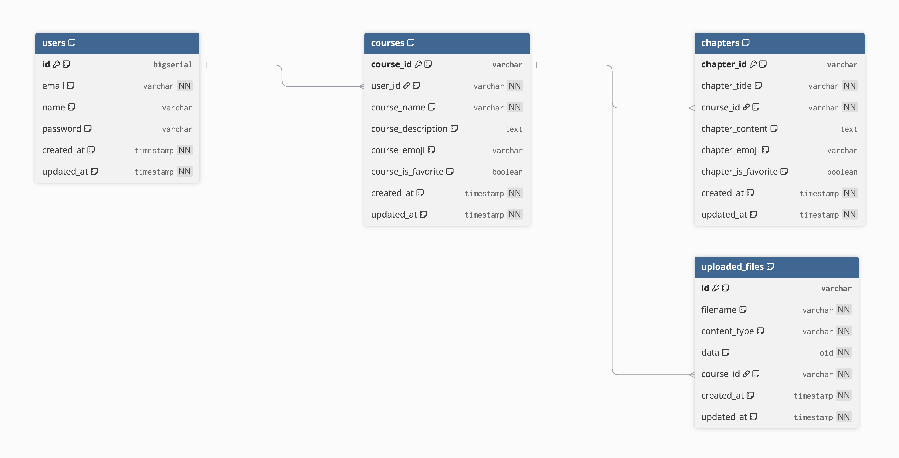

# DevOps 2025 - Team ReleaseRangers

This is a university project designed to enhance students learning experience by leveraging GenAI to create summaries of lecture material throughout the semester. We want to help students optimize their study time by automating the summarization process, allowing them to focus on understanding and applying rather than summarizing.

---

## Our Team

This project is maintained by:

- **Florian Charrot (FC)**
- **Jonathan Müller (JM)**
- **Luis Leutbecher (LL)**

---

## Student Responsibilities

| Week | Title                              | Student  | Description | Status | Impediments | Promises |
| ---- | ---------------------------------- | -------- | ----------- | ------ | ----------- | -------- |
| CW19 | Draft Problem Statement            | Everyone |             |        |             |          |
| CW20 | Create UML Models, Initial Backlog | Everyone |             |        |             |          |
| CW21 |                                    |          |             |        |             |          |
| CW22 |                                    |          |             |        |             |          |
| CW23 |                                    |          |             |        |             |          |

## Subsystem Ownership

- Subsystem1: ..
- Subsystem2: ..
- Subsystem3: ..
- ...

---

## Key Features

- **Upload all lecture material at a single place**
- **Structure relevant information into learning chapters**
- **Keep uploading whenever you receive new material**

---

## Project Overview

Our application helps students to study efficient by leveraging LLM generated smart summaries of their lecture material. Our vision is to create one single place where one can get a summarized overview of the lecture material needed for exam preparation. We want to enable students to easily add new content throughout the semester which constantly gets summarized to always provide the student with an up to date overview of the current course content.

---

## Setup Instructions

### Clone the Repository

### Client Setup

- create a `.env` file in the root directory of the project
- add the following environment variables:

  ```bash
  JWT_SECRET=<your_jwt_secret>
  CLIENT_URL=http://localhost:3000
  ```

  Attention: The JWT secret must be the same in both `.env` and `authentication-service/src/main/resources/application.properties` files.

### Server Setup

### LLM Service Setup

Make sure to create a .env file from the .env.example and add your API Key.

1. Navigate to the <code>genai</code> directory:

   ```bash
   cd genai
   ```

2. Install Dependencies:
   ```bash
   python3 -m venv .venv
   source .venv/bin/activate
   pip3 install -r requirements.txt
   ```

## Running the Application

### Start the Database

### Start the Client

### Start the Server

### Start the LLM Service

- Using uvicorn directly:
  ```bash
  cd genai
  uvicorn main:app --host 0.0.0.0 --port 8084
  ```
- Using python3:
  ```bash
  cd genai
  python3 main.py
  ```
- Using Docker:
  ```bash
  cd genai
  docker build -t llm .
  docker run --env-file .env -p 8084:8084 llm
  ```

## How to Use with Docker

```bash
docker compose up --build
```

---

## Tech Stack

- **Frontend**: React
- **Backend**: Spring Boot (Java)
- **GenAI Integration**: LangChain
- **AI models**: OpenAI, LLaMA
- **Database**: PostgreSQL

---

## Database Schema

Our application uses PostgreSQL as the primary database with tables distributed across three microservices:



### Schema Documentation

- **DBML File**: [database_schema.dbml](docs/database_schema.dbml) - Import this into [dbdiagram.io](https://dbdiagram.io) for interactive editing

### Key Tables

- **users** (Authentication Service): User accounts and authentication
- **courses** (Course Management): Course information and metadata
- **chapters** (Course Management): Individual learning chapters within courses
- **uploaded_files** (Upload Service): File uploads associated with courses

---

## Architecture Overview

### Top Level Architecture

### Subsystem Decomposition

---

## API documentation

The entire API is defined using OpenAPI (see [`api-collections/openapi.yml`](api-collections/openapi.yml)).

You can view the Swagger UI via GitHub Pages (if enabled for this repository):

- Open your browser and navigate to `https://aet-devops25.github.io/team-releaserangers/api/index.html`

This provides a complete, interactive overview of all endpoints, request/response formats, and authentication details.

---

## CI/CD Instructions

---

## Monitoring Instructions

## Monitoring & Alerting

We use Prometheus and Grafana for monitoring metrics and alerting, with Loki and Promtail for log aggregation. Alerts are configured in Grafana and can send notifications via email when certain conditions are met (e.g., upload errors). For full details, see [MONITORING_ALERTING.md](./MONITORING_ALERTING.md).

---

## Code Quality: SpotBugs & Checkstyle

### How to Run SpotBugs and Checkstyle

SpotBugs and Checkstyle are integrated into the Maven build lifecycle for the server and each microservice (authentication-service, coursemgmt-service, upload-service).

You can run these tools manually or as part of the Maven build:

- **To run both SpotBugs and Checkstyle for all modules:**

  ```sh
  cd server
  mvn verify
  ```

  This will execute both plugins as part of the `verify` phase.

- **To run only SpotBugs:**

  ```sh
  mvn spotbugs:check
  ```

- **To run only Checkstyle:**

  ```sh
  mvn checkstyle:check
  ```

- **To run for a specific microservice:**
  ```sh
  cd server/<microservice-folder>
  mvn verify
  ```
  Replace `<microservice-folder>` with `authentication-service`, `coursemgmt-service`, or `upload-service`.

### Maven Phase Integration

- **Checkstyle** runs during the `validate` and `verify` phases.
- **SpotBugs** runs during the `verify` phase.

If you run `mvn verify`, both tools will be executed and any violations will fail the build.

---
